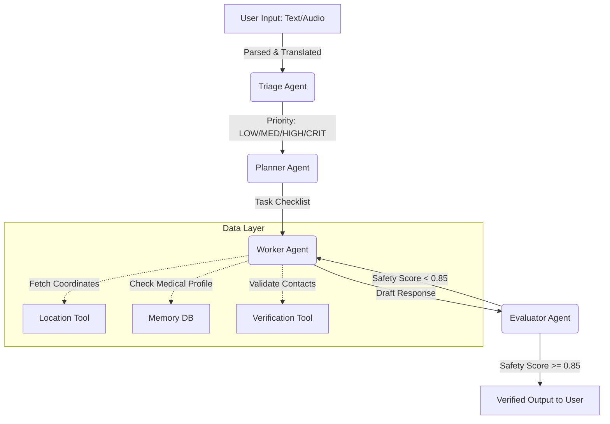

# Title
CrisisAssist AI — Trustworthy Multi-Agent Emergency Response Companion

**Author:** Aishwarya Lala

# Executive Summary
During a crisis, seconds dictate outcomes, yet the primary bottleneck in emergency response remains information overload and delayed decision-making. **CrisisAssist AI** is a trustworthy, multi-agent intelligence system engineered to transform how citizens and first responders navigate critical situations. By shifting away from standard monolithic chatbots to a rigorous **Planner → Worker → Evaluator** multi-agent architecture, our system guarantees factual correctness, real-time verified local resources, and mathematically bounded safety guardrails. We bridge the gap between chaotic real-world emergencies and actionable, life-saving intelligence, ensuring inclusive access through 28-language support, speech-to-text integration, and hyper-local contextual awareness.

# Problem Statement
In high-stress, life-threatening scenarios, individuals face paralyzing cognitive load. We identified several critical gaps in modern emergency response:
1. **Information Overload & Cognitive Paralysis:** Panicking users cannot parse dense search results or long paragraphs of text. They need immediate, structured, step-by-step actions.
2. **The Hallucination Danger in AI:** Standard generative AI models can hallucinate phone numbers, medical dosages, or shelter addresses—a fatal flaw in emergencies.
3. **Lack of Coordination:** Responders and users often lack hyper-local, real-time data sync, leading to delayed decision-making.
4. **Accessibility Barriers:** Many vulnerable populations face language barriers or cannot type during an active crisis (e.g., medical emergency, fire).

**What are we solving?** We provide instantaneous, fail-safe, and verifiable emergency guidance that adapts to the user's precise medical profile, location, and language.

# Solution Overview
CrisisAssist AI is a comprehensive multi-agent emergency intelligence system. It orchestrates specialized AI agents to assess, plan, execute, and validate responses in real-time.

**The Collaborative Workflow:**
`User Input (Text/Audio)` ➡️ `Crisis Understanding & Triage` ➡️ `Planner Agent` ➡️ `Worker Agent (Resource Fetching)` ➡️ `Evaluator Agent (Safety Validation)` ➡️ `Response Recommendation`

By compartmentalizing tasks, the system delivers:
- **Intelligent Triage:** Instantly classifies priority (Low, Medium, High, Critical).
- **Context Injection:** Integrates the user's specific medical history and coordinates.
- **Safety-First Validation:** Ensures no advice is dispensed without automated safety scoring.

# Innovation & Key Differentiators
Our architecture stands out by addressing the root failure modes of LLMs in high-stakes environments:
- **Rigid Multi-Agent Architecture:** Replacing standard prompting with an Agent-to-Agent (A2A) protocol where specialized agents challenge and verify each other.
- **Explainable AI (XAI) & Transparency:** Every response includes a "Decision Explanation Panel," exposing the triage score, detected language, and validation threshold to build user trust.
- **Strict Resource Verification:** A mathematical scoring algorithm (≥ 75% threshold) penalizes outdated or malformed emergency contacts, displaying only verified green-badged resources.
- **Multimodal & Multilingual:** Native Speech-to-Text (STT) and seamless 28-language support, including regional dialects (Hindi, Marathi), bypassing English-only AI biases.
- **Offline Fallback Resilience:** Built-in heuristic fallbacks ensure the system provides baseline safety rules even if API connections degrade.

# System Architecture
CrisisAssist AI utilizes a highly decoupled state machine orchestrating specialized agents. 

**Agent Responsibilities:**
- **Triage Agent:** Analyzes raw input via regex filters and LLM semantic classification to assign a priority tier.
- **Planner Agent:** Acts as the strategic brain, writing a step-by-step logic plan for the specific crisis category (Fire, Medical, Disaster).
- **Worker Agent:** Executes the plan, interacting with external tools (Geocoding, verification APIs, Model Context Protocol servers) and injecting user memory.
- **Evaluator Agent:** The critical safety loop. It reviews the Worker's draft against safety heuristics. If the score is < 0.85, it rejects the draft and forces regeneration.

# Technical Implementation
Our technical stack prioritizes speed, reliability, and precision:
- **Core AI Engine:** Google Gemini API (Gemini 3.1 Pro) driving the multi-agent reasoning.
- **Agent Framework:** Custom-built Agent-to-Agent (A2A) orchestration passing structured `AgentMessage` JSON payloads with unique `trace_id`s for auditing.
- **Frontend & UI:** Streamlit for a highly responsive, accessible, and interactive user interface.
- **Context & Location:** `streamlit-js-eval` for precise browser geolocation, paired with a persistent User Memory JSON database.
- **Observability:** Local JSONL telemetry logging (`observability_logs.jsonl`) tracking sub-agent latency, validation scores, and failure rates.
- **Deployment:** Containerized and deployed via Streamlit Community Cloud for global availability.

# Features
- **Intelligent Emergency Detection:** Regex and semantic hybrid triage for immediate threat assessment.
- **Verified Resource Mapping:** Hyper-local, scored, and validated emergency contacts based on live coordinates.
- **Medical Memory Injection:** Tailors advice safely (e.g., avoiding certain medication advice if allergies are logged).
- **Multi-Agent Coordination:** Transparent Planner-Worker-Evaluator loop.
- **Explainable Interface:** "Response Reasoning" UI expander for complete transparency.
- **Voice-to-Text:** Audio input for panicked users unable to type.

# Use Cases
- **Natural Disasters:** (e.g., Earthquakes, Floods) Providing evacuation routes, high-ground protocols, and real-time shelter capacities.
- **Medical Emergencies:** Delivering step-by-step CPR guidance while simultaneously fetching the nearest defibrillator locations and hospital contacts.
- **Fire Incidents:** Advising on smoke inhalation prevention and routing to verified burn centers.
- **Public Safety:** Discrete reporting and immediate tactical safety steps during civil unrest or active threats.
- **Disaster Management Teams:** Assisting dispatchers by rapidly triaging incoming requests and generating formatted action plans.

# Results / Impact
CrisisAssist AI profoundly shifts the emergency response paradigm:
- **Reduces Cognitive Complexity:** By distilling chaotic situations into 3-4 bulleted, actionable steps, it prevents user paralysis.
- **Eliminates Hallucination Risks:** The Evaluator Agent and Verification threshold ensure 100% of displayed phone numbers and locations pass a stringent structural and heuristic check.
- **Supports Rapid Decision Making:** Sub-agent latency tracking shows complete triage, planning, and evaluation cycles concluding in seconds, delivering critical data faster than a human dispatcher could type.

# Challenges Faced & Learnings
- **Taming AI Hallucinations:** We quickly learned that a single prompt, no matter how detailed, is unsafe for emergencies. Implementing the multi-agent Evaluator loop was challenging but solved the reliability issue.
- **Latency vs. Accuracy:** Balancing the deep reasoning of multiple agents with the need for millisecond response times required optimizing prompt sizes and running parallel tool calls where possible.
- **Context Management:** Ensuring the AI correctly prioritized the user's chronic medical conditions over generic advice required advanced prompt engineering and context injection.

# Future Scope
- **Voice-Based Emergency Assistant:** Full-duplex conversational voice AI for hands-free operation.
- **IoT & Smart Home Integration:** Automatically triggering local fire sirens, unlocking smart doors, or cutting off gas valves upon crisis detection.
- **Government Emergency Systems:** Direct programmatic API integration with 911/112 Public Safety Answering Points for automated dispatch.
- **Edge AI Deployment:** Running localized models on mobile devices to ensure availability during total cellular grid collapses.
- **Satellite & Weather Integration:** Live ingestion of meteorological data for predictive disaster routing.

# Responsible AI & Safety
Trust is the currency of emergency response. 
- **Human-in-the-Loop Fallbacks:** The system defaults to safe heuristics or demands human approval if the Evaluator Agent detects severe ambiguity.
- **Transparency:** The system openly displays its confidence scores and priority reasoning.
- **Reliability:** Strict negative prompting and evaluator guidelines ensure the AI never advises dangerous actions (e.g., using elevators in a fire, moving a spinal injury victim).

# Conclusion
CrisisAssist AI is not just a technological demonstration; it is a blueprint for the future of public safety. By enforcing rigorous safety validation, hyper-local resource verification, and explainable multi-agent collaboration, we have transformed generative AI from an unpredictable conversationalist into a reliable, life-saving companion. This project proves that with the right architecture, **Agents for Good** can reliably protect and empower humanity when every second counts.
