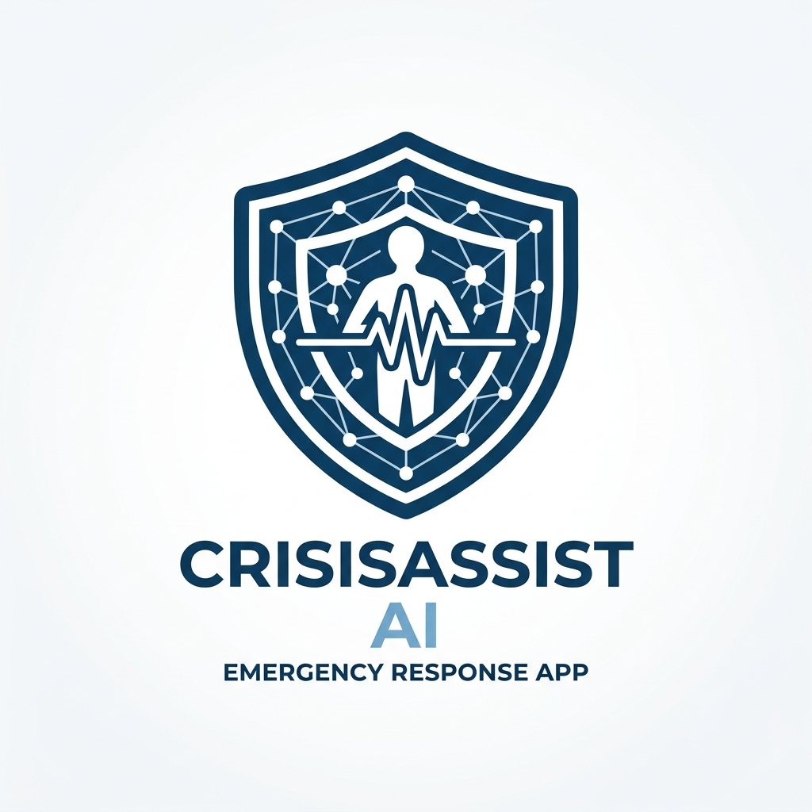

# CrisisAssist AI

<p align="center">
  
</p>

<p align="center">
  <strong>Your Trustworthy Multi-Agent Emergency Response Companion</strong>
</p>

---

## Project Overview

CrisisAssist AI is an intelligent, high-trust multi-agent emergency response companion designed to assist citizens and emergency responders. Unlike static search engines or simple chatbots, CrisisAssist AI utilizes collaborative agent workflows, strict resource verification, explainable triage logic, and regional language speech pipelines to deliver reliable, actionable guidance during critical situations.

Developed for the **Kaggle 5-Day AI Agents Capstone Project (Agents for Good track)**, CrisisAssist AI is designed to look like a premium, production-ready AI startup product, resolving coordination bottlenecks and verification hurdles in emergency management.

## Problem Statement

During emergency situations (natural disasters, medical crises, fires, or rescue needs), citizens and responders face critical challenges:
- **Intelligent Reasoning:** Standard systems cannot dynamically triage situations or customize step-by-step guidance based on user needs.
- **Personalization:** Existing apps neglect critical user medical history (e.g., insulin reliance, asthma, allergies, or mobility restrictions) and home location.
- **Adaptive Assistance:** Lack of support for regional dialects, voice queries, or low-bandwidth environments.
- **Explainability:** Answers are often delivered without validating resource freshness or explaining the rationale, causing trust deficits.

## Solution

CrisisAssist AI orchestrates a collaborative multi-agent pipeline using a structured **Planner -> Worker -> Evaluator** workflow:
1. **Priority & Triage:** Automatically detects urgency level (LOW, MEDIUM, HIGH, CRITICAL) and logs critical tags.
2. **Planner Agent:** Parses user request context and builds a structured, sequential action plan.
3. **Worker Agent:** The operational core. Executes steps using geocoding, local database resources, simulated MCP server alerts, and summarizer tools. Formulates actionable markdown guides.
4. **Evaluator Agent:** The validator. Performs automated safety audits (checking for dangerous advice, verifying contact reliability) and scores the response. If the score is below 85%, it requests revisions.

This system guarantees that every response is verified, safe, and tailored before it reaches the user.

## Features

- **Multilingual Support (28 Languages):** The entire user interface, instructions, error messages, and agent outputs seamlessly translate into 28 major languages (including English, Hindi, Marathi, Bengali, Telugu, Spanish, French, and Arabic).
- **Integrated Voice Input & Synthesized Playback:** Voice-to-text queries and synthesized text-to-speech outputs using regional voice synthesis.
- **Long-Term User Memory Profile:** Persists user medical conditions (e.g. allergies, mobility restrictions, diabetes) and default locations to automatically adapt safety advice.
- **Consolidated Resource Tool:** Resolves city coordinates, filters municipal contacts, and validates information freshness.
- **Agent Lifecycle Visualization:** Real-time visual timeline showing Planner, Worker, and Evaluator status updates.
- **Observability Telemetry Dashboard:** Full telemetry logging (latencies, token counts, evaluation scores) displayed on an interactive dashboard.

## Technologies

- **Frontend & App Interface:** Streamlit (Custom HSL/CSS premium layout, dark mode, glassmorphism card designs)
- **Agent Engine:** Google Gemini Developer APIs (via ADK framework / structured instructions)
- **Audio & Voice:** gTTS (Google Text-to-Speech)
- **Data & Logs:** JSON & JSONL local file-based database for user profiles and telemetry tracking.
- **Source Control:** Git & GitHub


## Usage

### Running the Streamlit Application
Start the main application dashboard:
```bash
streamlit run app.py
```

### Running the Telemetry Dashboard
Launch the observability log visualizer:
```bash
streamlit run dashboard/logs_dashboard.py
```

### Running the CLI/Console Demo
To test the multi-agent execution pipeline in your console:
```bash
python run_demo.py
```

## Future Scope

- **Offline Sync & Mesh Networks:** Implement local peer-to-peer data syncing for complete network blackouts.
- **Real-Time Municipal Integration:** Connect directly to active police, fire department, and hospital dispatch systems via secure APIs.
- **Advanced Diagnostic Input:** Attach images of injuries or damage for automated visual triage using Gemini Multimodal capabilities.
- **Automated Alert Broadcasts:** Geo-fenced push notifications to alert residents in high-risk areas.
