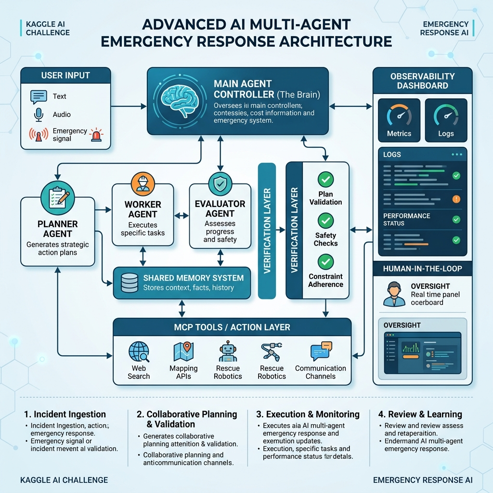

# Project Design — CrisisAssist AI

CrisisAssist AI is an intelligent, high-trust multi-agent emergency response companion designed to assist citizens and emergency responders. Unlike static search engines or simple chatbots, CrisisAssist AI utilizes collaborative agent workflows, strict resource verification, explainable triage logic, and regional language speech pipelines to deliver reliable, actionable guidance during critical situations.

---

## 1. Problem Statement

Emergency situations require quick decisions, reliable information, and personalized assistance. Existing emergency applications mostly provide static features and lack:
- **Intelligent Reasoning:** Inability to dynamically triage situations and customize step-by-step guidance.
- **Personalization:** Neglecting critical user medical history (e.g. insulin reliance, allergies) or default locations.
- **Adaptive Assistance:** Lack of support for regional dialects, voice queries, or low-bandwidth offline environments.
- **Explainability:** Delivering outputs without validating resource freshness or explaining why a decision was reached.

**CrisisAssist AI** solves this using multi-agent AI collaboration that triages, plans, executes, and evaluates responses before they reach the user.

---

## 2. Solution Overview

The system uses a collaborative **Planner → Worker → Evaluator** workflow orchestrated via standard message passing:

### Example Scenario
*   **User:** *"Mujhe madad chahiye, Pune me rasta block ho gaya hai."* (I need help, the road is blocked in Pune.)
*   **Planner Agent:**
    *   Detects the category as `Natural Disaster / General Support`.
    *   Creates a response plan: (1) Geocode location, (2) Fetch Pune road/shelter status, (3) Build safety advice.
*   **Worker Agent:**
    *   Calls the location tool and simulated MCP server to find shelter capacity.
    *   Verifies telephone contacts against authority databases.
    *   Generates a draft response in English.
*   **Evaluator Agent:**
    *   Reviews the draft for safety rules.
    *   Scores the draft. If it passes ($ \ge 85\% $), it approves the final release.
*   **Final Output:**
    *   Translates the safe advice back to Hindi and generates a synthesized text-to-speech voice file for playbacks.

---

## 3. Multi-Agent Architecture

The architecture connects user interfaces with distinct agents, memory caches, validation layers, and external telemetry tools.

---

## 4. Agent Responsibilities

*   **Planner Agent:** Parses user request context, determines crisis categorization (Medical, Fire, Disaster, Rescue, Support), and builds a structured, sequential action plan.
*   **Worker Agent:** The operational core. Executes steps using geocoding, local database resources, MCP server alerts, and summarizers. Formulates actionable markdown guides.
*   **Evaluator Agent:** The validator. Performs automated safety audits (checks for dangerous advice) and verifies contact reliability. Rejects draft and requests revisions if the quality score is below `0.85`.

---

## 5. Memory System

*   **Short-term memory:** Managed via `memory/session_memory.py`. Tracks chat history transcripts, active tool traces, and agent timeline metrics for the current run.
*   **Long-term memory:** Managed via `memory/user_memory.py`. Persists user profile information (Name, Default Location, Language preference, Emergency Contacts) and critical medical alerts (allergies, diabetes, mobility restrictions) in a local `user_profile.json` database.

---

## 6. Context Engineering

We use context engineering to insert user memory, home coordinates, and emergency rules directly into the agents' system instructions:
- **Triage Context:** Injects severity criteria (LOW, MEDIUM, HIGH, CRITICAL).
- **Planner Context:** Combines user medical alerts (e.g. Asthma) with crisis categorization rules.
- **Worker Context:** Injects geolocated coordinates and restricts advice to verified resources.
- **Evaluator Context:** Details safety audit constraints (e.g., forbidding elevator instructions during fires).

---

## 7. Observability

Observability logs are critical for trust. CrisisAssist AI tracks every execution trace:
- **JSONL Logging:** Writes logs to `data/observability_logs.jsonl` containing start times, stage latencies (Triage, Planning, Worker, Evaluator), token counts, and scores.
- **Agent Tracing Timeline:** Logs step-by-step state changes (STARTED, COMPLETED) to show users the active workflow in the console.
- **Telemetry Dashboard:** Renders KPI stats (Total runs, average latency, validation scores) and category distributions inside Streamlit.

---

## 8. Tools

*   **Location Lookup:** Resolves coordinates and filters municipal emergency contacts for major Indian cities.
*   **Resource Verification:** Grades resources based on operational status, phone formats, and timestamp freshness.
*   **Summarizer:** Compresses long safety guidelines into short checklists.
*   **Priority Triage:** Keyword-based and semantic classifier for urgency levels.
*   **Notification:** gTTS speech synthesizer for regional text-to-speech audio outputs.

---

## 9. A2A Protocol

All agents collaborate using a standardized JSON message envelope (`core/a2a_protocol.py`):
- `message_id`: Unique identifier (UUID).
- `trace_id`: Links all agent messages for a single query.
- `sender` / `receiver`: Routing definitions.
- `message_type`: Message role (REQUEST, RESPONSE, PLAN, EVAL_RESULT).
- `payload`: Contains JSON data models.
